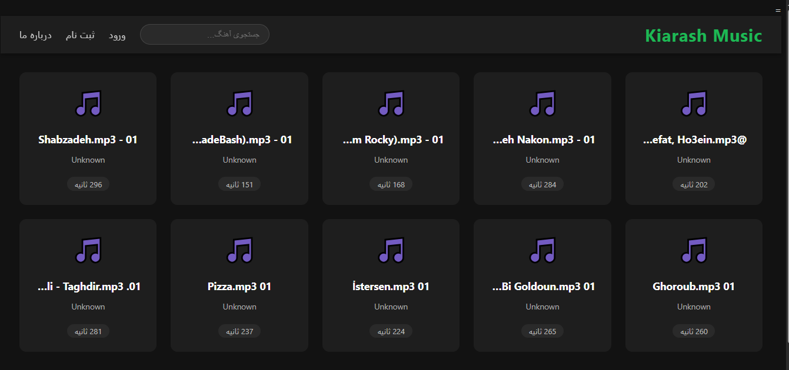
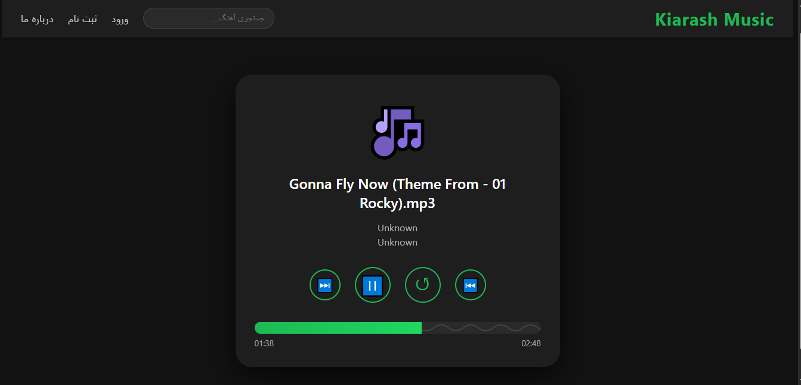

# 🎵 Kiarash Music


> **"در زمان جنگ این برنامه را ساختم... زمانی که نیاز به آرامش بود و موسیقی تنها پناهگاه."**  
> A lightweight, high-performance web music player built with Django.  
> Inspired by SoundCloud and Samsung Music, optimized for low-resource systems.

---

## ✨ Features

- 🎨 **Modern Dark UI** – Minimal, smooth animations, fully responsive.
- ⚡ **Ultra-Performance** – Pagination, caching, lazy loading, threaded scanning.
- 🔍 **Instant Search** – AJAX-based auto-suggestions.
- 🎧 **Professional Player** – Play/Pause, seek bar with waveform, previous/next track navigation.
- 🗄️ **Database Support** – SQL Server (preferred) or SQLite, with indexing and query optimization.
- 📁 **Auto-Scan** – Reads a music folder, extracts metadata via `mutagen`, and populates the database.
- 📄 **Open Source** – Customize and extend easily.

---

## 📸 Screenshots

| Home Page | Player Page |
|-----------|-------------|
|  |  |

*(Add screenshots to the `screenshots/` folder)*

---

## 🛠️ Tech Stack

- **Backend**: Django (Python)
- **Frontend**: HTML5, CSS3, Vanilla JavaScript (no heavy frameworks)
- **Database**: Microsoft SQL Server (via `mssql-django` + `pyodbc`) or SQLite
- **Audio Processing**: mutagen (metadata extraction)

---

## 🚀 Getting Started

### Prerequisites

- Python 3.8+
- pip
- SQL Server (optional, SQLite works out-of-the-box)

### Installation

```bash
# Clone the repository
git clone https://github.com/your-username/kiarash-music.git
cd kiarash-music

# Create virtual environment
python -m venv venv
# Activate (Windows)
venv\Scripts\activate
# Activate (Mac/Linux)
source venv/bin/activate

# Install dependencies
pip install -r requirements.txt

If you want to use SQL Server, make sure ODBC Driver 17 for SQL Server is installed and configure settings.py accordingly.
Otherwise, SQLite will be used automatically (no setup needed).

Database Setup

python manage.py makemigrations music
python manage.py migrate

Add Music Files

Place your audio files (mp3, flac, wav, ogg, m4a) into the musics/ folder (or any folder you prefer).
Then scan them into the database:

python manage.py scan_music

Run the Server

python manage.py runserver

Open http://127.0.0.1:8000 in your browser.

---

🎶 How to Use

· Home Page: Browse songs with pagination (10 per page).
· Search: Start typing to get real-time suggestions.
· Player: Click any song card to open the player with waveform seekbar and navigation buttons.
· About: Read the background story (optional login/register for future features).

---

⚙️ Configuration

· Music Folder: change MUSIC_FOLDER in music/management/commands/scan_music.py to point to your music directory.
· Cache: The app uses LocMemCache by default. For production, switch to Redis/Memcached.
· Pagination: Set items per page in views.py (default 10).

---

📁 Project Structure


kiarash-music/
├── manage.py
├── musics/                     # Music files (gitignored)
├── kiarash_music/              # Django project settings
├── music/                      # Main app
│   ├── models.py
│   ├── views.py
│   ├── urls.py
│   ├── management/commands/    # Custom commands (scan_music)
│   ├── templates/music/        # HTML templates
│   └── static/music/           # CSS, JS
├── staticfiles/                # Collected static (production)
└── requirements.txt

---

🤝 Contributing

Contributions are welcome!
Fork the project, create a feature branch, and sub

mit a pull request.

---

📜 License

This project is open-source and available under the MIT License.

---

💚 Acknowledgments

· Built with love during challenging times.
· Music is the universal language of peace.

---

```

---